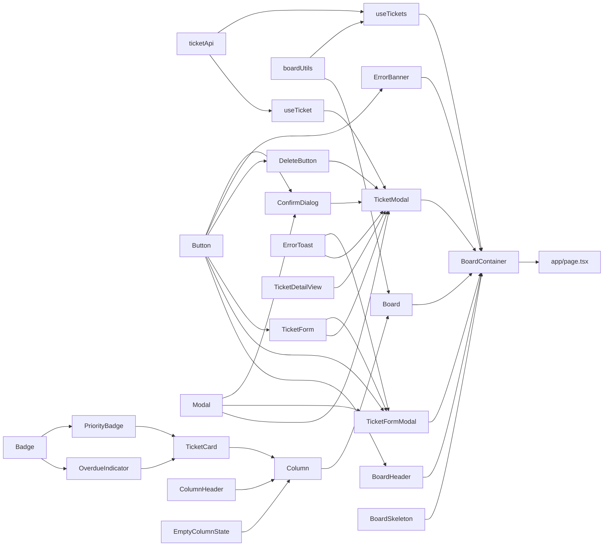

# Tika - 프론트엔드 구현 계획 (FRONTEND_TASKS.md)

> 기준 문서: COMPONENT_SPEC.md(컴포넌트·Props·동작), TEST_CASES.md §3~4(TC-COMP / TC-INT), TRD.md §1.4~1.5·§3·§4·§5.3, DESIGN_SYSTEM.md, API_SPEC.md §7(position 계산)
> 작성일: 2026-10-02 · 백엔드 API(`app/api/`, `src/server/`)는 완료된 상태이며 이 문서는 `src/client/` 구현만 다룬다.
> 진행 표시: `- [ ]` 미완료 / `- [X]` 완료. 작업이 끝날 때마다 이 파일의 체크박스를 갱신한다.

---

## 0. 한눈에 보기

### 현재 상태

| 항목 | 상태 |
|------|------|
| 백엔드 API 7개 엔드포인트 | 완료 (PR #8, #9 머지) |
| `app/globals.css` 디자인 토큰·컴포넌트 클래스 | 작성·빌드 검증 완료, **미커밋** (`feature/frontend-styles`) |
| `src/shared/design/colors.json` | 작성 완료, **미커밋** |
| `src/client/{api,components,hooks}` | 비어 있음 |
| `@dnd-kit/core` 6.3.1 · `sortable` 10.0.0 · `utilities` 3.2.2 | 설치 완료 |

### Phase 요약

| Phase | 내용 | 대상 | 선행 |
|-------|------|------|------|
| **P0** | 사전 결정 · 테스트 인프라 | 스펙 갭 해소, TC 보강, fixture | - |
| **P1** | 데이터 계층 | `ticketApi`, `boardUtils`, `useTickets`, `useTicket` | P0 |
| **P2** | UI primitive · 말단 컴포넌트 | `Button`, `Badge`, `PriorityBadge`, `OverdueIndicator`, `Modal`, `ConfirmDialog`, `EmptyColumnState`, `BoardSkeleton`, `ErrorBanner`, `ErrorToast` | P0 (P1과 병렬 가능) |
| **P3** | 카드 · 칼럼 | `ColumnHeader`, `TicketCard`, `Column` | P1 일부, P2 |
| **P4** | 보드 (DnD) | `Board` | P1, P3 |
| **P5** | 폼 · 모달 | `TicketForm`, `TicketDetailView`, `DeleteButton`, `TicketFormModal`, `TicketModal` | P1, P2 |
| **P6** | 헤더 · 컨테이너 · 페이지 | `BoardHeader`, `BoardContainer`, `app/page.tsx` | P1~P5 |
| **P7** | 통합 · 마무리 | TC-INT, 수동 점검, 접근성, 문서 | P6 |

---

## 1. 공통 규칙

### 1.1 컴포넌트별 TDD 사이클 (모든 항목에 공통 적용)

각 컴포넌트 블록의 체크리스트는 아래 순서를 따른다. 블록에는 **Red 단계의 테스트 항목**과 구현 메모만 적고, 공통 단계는 반복하지 않는다.

1. **명세 확인**: COMPONENT_SPEC의 해당 절과 TEST_CASES의 TC를 읽는다. TC가 없으면 먼저 TEST_CASES.md에 추가한다 (P0-2).
2. **Red**: 테스트를 먼저 작성하고 **실패하는 것을 확인**한다 (`npm run test -- <파일>`). 컴파일 오류만으로 실패하는 상태는 Red로 치지 않으므로, 빈 컴포넌트 스텁을 두고 단언 실패를 확인한다.
3. **Green**: 테스트를 통과시키는 최소 구현만 작성한다.
4. **Refactor**: 중복 제거, 이름 정리. 테스트는 계속 통과해야 한다.
5. **명세 대조**: Props 이름·타입, 접근성 속성(§11), `globals.css` 클래스 사용 여부를 확인한다.
6. **검증**: `npx tsc --noEmit` → `npm run test:components` → (Phase 끝에) `npm run build`.
7. **체크박스 갱신**, 의미 있는 단위로 커밋 (`[CL] feat: ...`, `[CL] test: ...`).

### 1.2 코딩 규칙 (CLAUDE.md 요약)

- 함수 컴포넌트 + 화살표 함수, Props 타입은 **컴포넌트 파일 안에** 정의, 파일명 PascalCase (`TicketCard.tsx`).
- `any` 금지, 공유 타입은 `@/shared/types`에서 import, enum 대신 const 객체.
- API 호출은 **`src/client/api/ticketApi.ts`를 통해서만** (컴포넌트·훅에서 `fetch` 직접 호출 금지).
- 낙관적 업데이트와 롤백은 훅(`useTickets`)이 책임진다. 컴포넌트는 props만 표시한다.
- `"use client"`는 **`BoardContainer` 한 곳**에만 선언한다 (TRD §1.4). 하위 컴포넌트는 별도 선언하지 않는다.
- `src/client/`에서 `src/server/`를 import하지 않는다. 검증 스키마는 `@/shared/validations`를 재사용한다.
- 스타일은 `app/globals.css`의 클래스(`.btn--primary`, `.card--overdue` 등)를 우선 사용하고, 필요한 Tailwind 유틸리티만 보조로 쓴다.
- `console.log`, `.skip()`, 명세에 없는 기능 추가 금지.

### 1.3 테스트 규칙

- 위치: `__tests__/components/<이름>.test.tsx`, `__tests__/hooks/<이름>.test.ts(x)`, `__tests__/api/ticketApi.test.ts`. 환경은 jsdom(기본값)이며 `@jest-environment node`를 붙이지 않는다.
- 도구: `@testing-library/react`, `@testing-library/user-event`(v14, `userEvent.setup()`), `@testing-library/jest-dom`.
- 쿼리 우선순위: `getByRole`(+`name`) → `getByLabelText` → `getByText`. 구현 세부(클래스명 등)는 **스타일 variant를 확인해야 할 때만** 단언한다.
- fixture: `__tests__/helpers/fixtures.ts`의 `makeTicket(overrides)`, `makeBoard(overrides)`를 쓰고, 테스트마다 데이터를 새로 만든다.
- 시간·타이머: `jest.useFakeTimers()`는 `ErrorToast` 같은 타이머 테스트에서만 쓰고 `afterEach`에서 복구한다.
- API mock: 컴포넌트·훅 테스트는 `jest.mock("@/client/api/ticketApi")`로 대체하고, `ticketApi` 자체 테스트만 `global.fetch`를 mock한다.

**dnd-kit 테스트 전략** (jsdom에는 레이아웃이 없어 실제 드래그 시뮬레이션이 불안정하다)

| 대상 | 방법 |
|------|------|
| 드롭 결과 계산 | `boardUtils`의 순수 함수로 분리해 단위 테스트 (P1) |
| `Board`의 `onDragEnd` 분기 | `@dnd-kit/core`의 `DndContext`를 mock해 핸들러를 캡처하고, `{ active: { id }, over: { id } }` 형태의 가짜 이벤트로 직접 호출 |
| `TicketCard`·`Column` | 실제 `DndContext` + `SortableContext`로 감싸 렌더링만 검증 (드래그 동작 없음) |
| 센서 설정 (TRD §1.5) | `useSensor` 호출 인자를 검증하거나 설정 상수를 export해 단위 테스트 |
| 실제 마우스·터치·키보드 드래그 | **수동 점검**(P7) 또는 통합 도구 도입 후 자동화 (결정 D10) |

**jsdom으로 검증할 수 없는 항목**: 색상이 실제로 다르게 보이는지(TC-COMP-001-06, 009-03/04), 반응형 배치(TC-COMP-003-08~10), 말줄임(TC-COMP-001-07). 자동 테스트는 variant 클래스·속성 존재까지만 확인하고, 시각 결과는 P7 수동 점검 표에 넣는다.

### 1.4 브랜치와 커밋

- 브랜치: `feature/frontend-*` (CLAUDE.md 브랜치 전략). 현재 `feature/frontend-styles`에서 시작하고, Phase 단위로 이어서 진행한다.
- 커밋 접두사 `[CL]`, 타입은 `feat`/`test`/`docs`/`refactor`. 한 컴포넌트의 Red→Green은 가능하면 `test:`와 `feat:`를 나누어 커밋한다.
- 커밋 전 체크: `npx tsc --noEmit`, `npm run test`, `npm run build`, `console.log` 없음, `.env` 미포함.

---

## 2. 구현 순서와 의존성 그래프

### 2.1 의존성 그래프

화살표는 **"먼저 만들어야 하는 것 → 이를 사용하는 것"** 방향이다. 화살표가 들어오는 노드는 화살표가 나가는 모든 노드가 끝난 뒤에 만든다.

### 2.2 컴포넌트별 선행 관계 표

| # | 컴포넌트 | Phase | 직접 선행 | 참조 스펙 |
|---|---------|-------|-----------|-----------|
| 1 | `ticketApi` | P1 | - | TRD §3, API_SPEC |
| 2 | `boardUtils` | P1 | - | API_SPEC §7, DATA_MODEL §5.5 |
| 3 | `useTickets` | P1 | 1, 2 | §3.5 |
| 4 | `useTicket` (신설 제안) | P1 | 1 | §6.2 |
| 5 | `Button` | P2 | - | §8.8 |
| 6 | `Badge` | P2 | - | §8.6 |
| 7 | `PriorityBadge` | P2 | 6 | §5.2 |
| 8 | `OverdueIndicator` | P2 | 6 | §5.3 |
| 9 | `Modal` | P2 | - | §8.5 |
| 10 | `ConfirmDialog` | P2 | 5, 9 | §8.7, §6.3 |
| 11 | `EmptyColumnState` | P2 | - | §8.4 |
| 12 | `BoardSkeleton` | P2 | - | §8.1 |
| 13 | `ErrorBanner` | P2 | 5 | §8.2 |
| 14 | `ErrorToast` | P2 | - | §8.3 |
| 15 | `ColumnHeader` | P3 | - | §4.2 |
| 16 | `TicketCard` | P3 | 7, 8 | §5.1 |
| 17 | `Column` | P3 | 11, 15, 16 | §4.1 |
| 18 | `Board` | P4 | 2, 17 | §3.4, §7 |
| 19 | `TicketForm` | P5 | 5 | §6.2 |
| 20 | `TicketDetailView` | P5 | - | §6.2 |
| 21 | `DeleteButton` | P5 | 5 | §6.3 |
| 22 | `TicketFormModal` | P5 | 5, 9, 14, 19 | §6.1 |
| 23 | `TicketModal` | P5 | 4, 9, 10, 14, 19, 20, 21 | §6.2 |
| 24 | `BoardHeader` | P6 | 5 | §3.3 |
| 25 | `BoardContainer` | P6 | 3, 12, 13, 18, 22, 23, 24 | §3.2 |
| 26 | `app/page.tsx` | P6 | 25 | §3.1 |

### 2.3 병렬로 진행할 수 있는 묶음

- P1 안에서 `ticketApi`와 `boardUtils`는 서로 독립이다.
- P2는 P1과 독립이므로 병렬 가능하고, P2 안에서도 `Button` / `Badge` / `Modal` / `EmptyColumnState` / `BoardSkeleton` / `ErrorToast` / `ColumnHeader` / `TicketDetailView`는 서로 독립이다.
- `TicketForm`과 `TicketDetailView`는 서로 독립이다.
- 한 명이 순서대로 진행한다면 위 표의 번호 순서가 곧 권장 순서다.

---

## 3. 사전 결정이 필요한 사항 (스펙 갭)

문서를 대조하면서 찾은 항목이다(✅ = 결정과 문서 반영 완료). **해당 Phase 시작 전에 결정하고 문서를 먼저 수정**한다 (CLAUDE.md: 명세에 없는 기능 임의 추가 금지, API 응답 형식 변경 시 문서 먼저).

| ID | 문제 | 근거 | 제안 | 필요한 시점 |
|----|------|------|------|-------------|
| D1 ✅ | `useTickets`에 **다시 불러오기(`refetch`) 액션이 없다**. 그런데 TC-COMP-004-04는 "재시도 클릭 시 보드 화면으로 전환"을 요구한다. | §3.5 인터페이스, TC-COMP-004-04 | **결정·문서 반영 완료(2026-10-02).** `refetch: () => Promise<void>` 추가하고 §3.5 표에 `GET /api/tickets`로 명시 | P1 |
| D2 ✅ | **초기 데이터를 어디서 가져오는가.** §3.1은 서버 컴포넌트가 페칭하지 않는다고 하고, §3.2는 로딩 스켈레톤을 요구하며, §3.5는 `useTickets(initialData)`를 정의한다. | §3.1, §3.2, §3.5 | **결정·문서 반영 완료(2026-10-02).** 마운트 시 클라이언트에서 `GET /api/tickets`를 호출해 `isLoading`을 관리한다. 시그니처는 `useTickets(initialData?: BoardData)`로, 값이 없으면 최초 조회를 수행하고 있으면 건너뛴다 (테스트 주입·향후 SSR 대비) | P1 |
| D3 ✅ | 액션이 실패할 때 **Promise를 reject하는가**, 필드 오류(`error.field`)를 어떻게 전달하는가. 모달이 "실패 시 유지"되려면 호출부가 실패를 알아야 한다. | TC-COMP-006-06/08, 007-10, 008-06 | **결정·문서 반영 완료(2026-10-02).** `create`/`update`/`remove`는 **`ApiError`로 reject**한다. `error.field`가 있는 400은 폼 필드에 인라인으로만 표시하고(`error` 상태 미설정), 그 외 실패는 `error`를 채워 `ErrorToast`로 표시한다. `reorder`/`complete`는 조용히 롤백하고 reject하지 않는다. `clearError()` 추가 | P1 |
| D4 ✅ | `TicketModal`의 **상세 조회(`GET /api/tickets/:id`)를 누가 하는가.** 컴포넌트가 직접 호출하면 §3.5("API 호출·롤백 책임은 훅")와 어긋나고, `useTickets` 액션 표에는 조회가 없다. | §3.5, §6.2 | **결정·문서 반영 완료(2026-10-02).** 훅 `useTicket(ticketId)`(조회·로딩·에러)를 `src/client/hooks/`에 신설하고 §3.5·§6.2에 명시 | P1 |
| D5 ✅ | `TicketForm`의 `ticket` prop이 **필수**인데 생성 모달(§6.1)도 이 폼을 쓴다. | §6.1, §6.2 | **결정·문서 반영 완료(2026-10-02).** `ticket?: TicketWithMeta`(선택)로 바꾸고 없으면 생성 모드(빈 초기값 + 우선순위 MEDIUM). `ticket` 유무로 `onSubmit` 시그니처가 갈리는 판별 유니온 Props로 정의 | P5 |
| D6 ✅ | **카드의 Enter/Space와 dnd-kit 키보드 조작이 충돌**한다. TC-COMP-001-09는 Enter/Space로 모달을 열고, TC-COMP-003-07은 Space로 픽업한다. dnd-kit `KeyboardSensor`의 기본 시작 키는 Space와 Enter 둘 다이다. | TC-COMP-001-09, 003-07, TRD §1.5 | **결정·문서 반영 완료(2026-10-02).** `KeyboardSensor`의 `keyboardCodes.start`를 `["Space"]`로 제한하고, 카드는 **Enter만** 모달을 연다. TC-COMP-001-09와 §5.1·§11을 "Enter"로 수정 (TRD §1.5의 "커스텀 키 매핑 없음" 문구도 함께 보정) | P3 |
| D7 ✅ | **카드에 설명을 표시하는가.** §5.1 표시 요소에는 설명이 없지만 TC-COMP-001-12("설명이 없는 카드… 설명 텍스트 영역 없이")와 와이어프레임은 설명이 있는 카드를 전제한다. | §5.1, TC-COMP-001-12, tika-wireframe.png | **결정·문서 반영 완료(2026-10-02).** 와이어프레임 기준으로 **설명을 최대 2줄 말줄임으로 표시**하고 §5.1에 추가 (TC-COMP-001-13~14 신설, `.card-desc` 스타일 추가) | P3 |
| D8 ✅ | **빈 칼럼의 position 값**과 **DONE 칼럼 내부 드래그** 처리가 명세에 없다. | API_SPEC §7, DATA_MODEL §5.5, §3.6 | **결정·문서 반영 완료(2026-10-02).** 빈 칼럼은 `1024` (DATA_MODEL의 "칼럼이 비면 1024"와 일치). DONE 안에서의 이동은 서버가 `complete`를 멱등 처리하므로 **호출하지 않고 무시**, 카드는 제자리로 복귀 (TC-COMP-003-15/16 신설) | P1 (`boardUtils`) |
| D9 ✅ | `ErrorToast`가 **언제 사라지는지** 정의가 없다 (props는 `message`뿐). | §8.3 | **결정·문서 반영 완료(2026-10-02).** 5초 후 자동으로 사라지는 타이머를 내부에 두고, `onDismiss` prop을 추가해 훅의 `clearError()`에 연결한다 (같은 오류가 다시 나도 토스트가 다시 뜨도록). `message`가 바뀌면 타이머 재시작 | P2 |
| D10 ✅ | **통합 테스트(TC-INT) 방식.** 실제 화면 조작 + 실제 API·DB를 한 번에 돌리려면 Jest(jsdom)만으로는 `Request`/`Response`·DB 연결이 어렵다. | TEST_CASES §4, §5 Phase 4 | **결정(2026-10-02): 수동 점검으로 수행.** 영속성은 API 테스트가, 낙관적 업데이트·롤백은 훅 테스트가 보증한다. 자동화 도구(Playwright 등) 도입은 별도 승인 후 결정하며 지금은 설치하지 않는다 | P7 |
| D11 ✅ | 순수 함수를 둘 **새 디렉터리**(`src/client/lib/`)와 테스트 폴더(`__tests__/lib/`)는 CLAUDE.md 구조에 없다. | CLAUDE.md 프로젝트 구조 | **결정·문서 반영 완료(2026-10-02).** `src/client/lib/`, `__tests__/lib/` 허용. CLAUDE.md, TRD §1.3·§5.3, `package.json`의 `test:components`에 반영 | P1 |

---

## 4. Phase별 작업

### Phase 0. 사전 준비

- [X] **P0-1 스펙 갭 결정과 문서 반영**: §3의 D1~D9, D11을 결정하고 COMPONENT_SPEC.md / TEST_CASES.md를 수정한다 (D10은 P7에서). **D1, D6, D7은 완료**(COMPONENT_SPEC §3.5·§5.1·§7·§11, TRD §1.5, TEST_CASES TC-COMP-001-09·13~15 반영), 나머지 D2~D5, D8, D9, D11도 결정·반영 완료했고 D10은 수동 점검으로 결정했다. 남은 일은 P0-2의 TC 보강이다.
- [X] **P0-2 TEST_CASES.md 보강** (완료 — TEST_CASES.md §3.10~3.17, 총 TC 약 80개):
  - `ticketApi`: 7개 함수의 URL·메서드·본문, 성공/실패(`ApiError`), 네트워크 오류, 날짜 복원 (`TC-CLIENT-API-001-01~14`, §3.14)
  - `boardUtils`: `calculatePosition`, `resolveDropTarget`, `moveTicket` 등 (`TC-CLIENT-UTIL-001-01~26`, §3.15)
  - `useTickets` / `useTicket`: 로딩, 낙관적 업데이트, 롤백 (`TC-HOOK-001-01~18`, `TC-HOOK-002-01~06`, §3.16~3.17)
  - 독립 컴포넌트: `ConfirmDialog`(§8.7), `EmptyColumnState`, `BoardSkeleton`, `ErrorBanner`, `ErrorToast`, `PriorityBadge`/`OverdueIndicator` (`TC-COMP-010-01~09`, `011-01~04`, `012-01~04`, `013-01~04`, §3.10~3.13)
  - 번호는 확정했다. 구현할 때는 각 컴포넌트·함수 블록 제목의 TC 번호를 기준으로 테스트 이름에 TC ID를 적는다.
- [ ] **P0-3 테스트 지원 코드**
  - [ ] `__tests__/helpers/fixtures.ts`: `makeTicket`, `makeBoard` (Red 불필요, 사용하는 테스트로 검증)
  - [ ] dnd-kit mock 헬퍼: `DndContext` props를 캡처하는 `jest.mock` 패턴을 한 곳에 정리 (`__tests__/helpers/dndMock.tsx`)
  - [ ] `jest.setup.ts`에 필요한 환경 보강 확인 (`ResizeObserver` 등 jsdom 미지원 API가 dnd-kit에서 필요한지 첫 렌더 테스트에서 확인)
  - [X] `package.json`의 `test:components`에 `__tests__/lib` 추가 (D11)
  - [ ] 확인: `npm run test:components`가 빈 폴더에서도 오류 없이 동작
- [ ] **P0-4 스타일 선행 작업 정리**: `feature/frontend-styles`의 `globals.css`, `colors.json`을 커밋한다. 설명 영역(D7)용 `.card-desc`(2줄 말줄임)는 `globals.css`에 추가 완료했고, `.card-title`의 말줄임(TC-COMP-001-07)은 P3에서 보강한다.

---

### Phase 1. 데이터 계층

#### P1-1. `ticketApi`

구현 `src/client/api/ticketApi.ts` · 테스트 `__tests__/api/ticketApi.test.ts` · 선행 없음 · 참조 TRD §3, API_SPEC 전체 · TC `TC-CLIENT-API-001-01~14`

함수: `fetchBoard`, `fetchTicket(id)`, `createTicket(input)`, `updateTicket(id, input)`, `deleteTicket(id)`, `completeTicket(id)`, `reorderTicket(input)` + 에러 클래스 `ApiError`(`status`, `code`, `message`, `field?`).

- [ ] Red: `fetchBoard`가 `GET /api/tickets`를 호출하고 4개 칼럼 객체를 반환한다
- [ ] Red: `createTicket`/`updateTicket`/`reorderTicket`이 올바른 메서드·URL·JSON 본문·`Content-Type` 헤더로 호출한다 (`updateTicket`은 `/api/tickets/:id`, `completeTicket`은 `/api/tickets/:id/complete`)
- [ ] Red: 응답의 `startedAt`/`completedAt`/`createdAt`/`updatedAt` ISO 문자열이 `Date`로 복원된다 (DATA_MODEL §4 "프론트엔드에서 수신 시 `new Date(...)`로 파싱하는 것을 전제"), `plannedStartDate`/`dueDate`는 문자열 그대로
- [ ] Red: `deleteTicket`은 `204`(본문 없음)에서 오류 없이 완료된다
- [ ] Red: 4xx/5xx 응답이 `{error:{code,message,field?}}`를 담은 `ApiError`로 reject된다 (`field`가 없으면 `undefined`)
- [ ] Red: 본문이 JSON이 아닌 5xx 응답, `fetch` 자체의 reject(네트워크 오류)도 `ApiError`(예: `code: "NETWORK_ERROR"`)로 통일된다
- [ ] 구현 메모: `fetch` 호출은 이 파일 안에서만, 반환 타입은 `@/shared/types` 사용, 공통 요청 함수 하나로 중복 제거
- [ ] 명세 대조: API_SPEC의 URL·메서드·상태 코드와 일치하는가

#### P1-2. `boardUtils` (순수 함수, 결정 D11)

구현 `src/client/lib/boardUtils.ts` · 테스트 `__tests__/lib/boardUtils.test.ts` · 선행 없음 · TC `TC-CLIENT-UTIL-001-01~26`

- [ ] Red `calculatePosition(prev, next)`: 두 값 사이 → `Math.ceil((prev+next)/2)` (예: 1024, 2048 → 1536 / 1024, 1025 → 1025)
- [ ] Red: 맨 앞(`prev=null`) → `next - 1024`, 맨 뒤(`next=null`) → `prev + 1024`, 빈 칼럼(둘 다 null) → `1024` (D8)
- [ ] Red `resolveDropTarget(board, activeId, overId)`: 카드 위에 드롭 → 그 카드의 칼럼과 앞뒤 이웃 기준 position, 칼럼 영역에 드롭 → 해당 칼럼 맨 뒤
- [ ] Red: **같은 칼럼 안 이동**에서는 이동 카드 자신을 이웃 계산에서 제외한다 (위로 이동 / 아래로 이동 각각)
- [ ] Red: 대상이 DONE이면 `complete` 액션 대상으로 구분한다 (`{ kind: "complete" }` / `{ kind: "reorder", status, position }`), DONE 칼럼 안에서의 이동과 제자리 드롭은 `null` (D8)
- [ ] Red `moveTicket(board, ticketId, status, position)`: 원본 불변, 원래 칼럼에서 제거, 대상 칼럼에 `status`/`position`을 반영해 position 오름차순으로 삽입
- [ ] Red: `completeInBoard`는 DONE 맨 위에 두고 `completedAt`을 현재 시각으로 채운다 (낙관적 반영용)
- [ ] Red: `insertTicket`(생성 → BACKLOG 맨 위), `replaceTicket`(수정), `removeTicket`(삭제)이 불변으로 동작하고, 없는 id에는 보드를 그대로 반환한다
- [ ] 구현 메모: 모든 함수는 `BoardData`를 새 객체로 반환, 테스트는 `makeBoard` 사용

#### P1-3. `useTickets`

구현 `src/client/hooks/useTickets.ts` · 테스트 `__tests__/hooks/useTickets.test.tsx` (`renderHook`, `ticketApi` mock) · 선행 P1-1, P1-2 · 참조 §3.5, §7 · TC `TC-HOOK-001-01~18`

- [ ] Red: 마운트 시 `isLoading=true`, 응답 후 `board`가 채워지고 `isLoading=false` (D2)
- [ ] Red: 초기 조회 실패 시 `error` 메시지가 채워지고 `isLoading=false`
- [ ] Red: `initialData`를 넘기면 최초 조회를 건너뛰고 그 값이 `board`가 된다 (D2)
- [ ] Red: `error.field`가 있는 400은 `error` 상태를 채우지 않고 reject만 한다(필드 오류는 폼에 인라인), 그 외 실패는 `error`를 채운다 (D3)
- [ ] Red: `clearError()`가 `error`를 비운다 — 같은 오류가 다시 발생하면 `error`가 다시 채워진다 (D9)
- [ ] Red: `refetch()`가 다시 조회해 오류를 지우고 `board`를 갱신한다 (D1)
- [ ] Red `create`: 성공 시 응답 티켓이 BACKLOG 맨 위에 추가된다. 실패 시 `ApiError`로 reject한다 (D3, `error` 상태 규칙은 아래 항목)
- [ ] Red `update`: 성공 시 보드의 해당 카드가 서버 응답으로 교체된다. 실패 시 보드는 그대로이고 reject한다
- [ ] Red `remove`: 성공 시 카드가 제거된다. 실패 시 카드가 남고 reject한다
- [ ] Red `reorder`: 호출 **즉시** 보드가 낙관적으로 바뀌고(API 응답 전), 성공 시 서버가 돌려준 보드로 확정된다
- [ ] Red `reorder` 실패: 드롭 이전 스냅샷으로 **조용히** 롤백하고 `error`는 채우지 않으며 reject하지 않는다 (TC-COMP-003-12, §7)
- [ ] Red `complete`: 낙관적으로 DONE 맨 위로 이동 → 성공 시 확정, 실패 시 롤백
- [ ] Red: 연속 호출에서 스냅샷이 섞이지 않는다 (두 번째 실패가 첫 번째 성공 결과를 되돌리지 않는다)
- [ ] 구현 메모: 상태는 `useState`/`useRef`로 스냅샷 보관, 컴포넌트에서 `fetch` 호출 없음, 언마운트 후 `setState` 경고가 없는지 확인

#### P1-4. `useTicket` (결정 D4)

구현 `src/client/hooks/useTicket.ts` · 테스트 `__tests__/hooks/useTicket.test.tsx` · 선행 P1-1 · TC `TC-HOOK-002-01~06`

- [ ] Red: `ticketId`가 `null`이면 조회하지 않고 `ticket=null`, 로딩 아님
- [ ] Red: `ticketId`가 주어지면 `isLoading=true` → 응답 후 `ticket` 채움 (TC-COMP-007-01/02)
- [ ] Red: 404/500이면 `error`가 채워지고 `ticket`은 `null` (TC-COMP-007-12)
- [ ] Red: `ticketId`가 바뀌면 이전 응답이 새 요청 결과를 덮어쓰지 않는다 (경쟁 상태)

**Phase 1 완료 기준**: 위 항목의 테스트 통과, `npx tsc --noEmit`, `src/client` 안에 `fetch` 직접 호출은 `ticketApi.ts`뿐.

---

### Phase 2. UI primitive · 말단 컴포넌트

공통 위치: 구현 `src/client/components/<이름>.tsx`, 테스트 `__tests__/components/<이름>.test.tsx`.

#### P2-1. `Button` (§8.8)

선행 없음 · 클래스 `.btn`, `.btn--primary/secondary/danger/ghost`, `.btn--sm/lg`, `.btn-spinner`

- [ ] Red: TC-COMP-009-04 — variant 4종이 서로 다른 variant 클래스를 가진다, 기본값은 `primary`, `size` 기본 `md`
- [ ] Red: TC-COMP-009-05 — `isLoading=true`이면 스피너가 보이고 `disabled`이며 클릭해도 `onClick`이 호출되지 않는다 (`aria-busy`)
- [ ] Red: TC-COMP-009-07 — `onClick`이 없어도 클릭 시 오류가 없다
- [ ] Red: 기본 `type="button"`(폼 안에서 의도치 않은 제출 방지), `type="submit"` 전달 가능, `children` 렌더링
- [ ] 구현 메모: 나머지 button 속성(`aria-label`, `disabled`)은 그대로 전달

#### P2-2. `Badge` (§8.6)

- [ ] Red: TC-COMP-009-03 — `variant` 5종(`low`/`medium`/`high`/`overdue`/`neutral`)이 각각 다른 variant 클래스를 가진다 (색상 자체는 P7 수동 확인)
- [ ] Red: `children` 텍스트가 보인다
- [ ] 명세 대조: §8.6 매핑 표에 `neutral` 행이 없으므로 표에 추가

#### P2-3. `PriorityBadge` (§5.2, TC-COMP-013-01~02)

선행 `Badge`

- [ ] Red: `priority`별로 텍스트(LOW/MEDIUM/HIGH)가 보이고 해당 variant가 적용된다 (TC-COMP-001-06 일부, §11 "색상에만 의존하지 않음")

#### P2-4. `OverdueIndicator` (§5.3, TC-COMP-013-03~04)

선행 `Badge`

- [ ] Red: "지연" 텍스트와 경고 아이콘이 보이고 `aria-label="지연됨"`이 있다 (TC-COMP-001-04 일부)
- [ ] Red: 아이콘은 장식(`aria-hidden`)이며 텍스트가 함께 있다

#### P2-5. `Modal` (§8.5)

- [ ] Red: TC-COMP-009-06 — `isOpen=false`이면 모달·오버레이가 DOM에 없다
- [ ] Red: `isOpen=true`이면 `role="dialog"`, `aria-modal="true"`로 `children`이 보인다
- [ ] Red: TC-COMP-009-02 — 오버레이 바깥 클릭 시 `onClose` 호출, **모달 내부 클릭은 호출하지 않는다**
- [ ] Red: Esc 입력 시 `onClose` 호출
- [ ] Red: TC-COMP-009-01 — 열려 있는 동안 `body` 스크롤이 잠기고, 닫히거나 언마운트되면 복구된다
- [ ] Red: 열리면 내부 첫 포커스 가능 요소로 포커스가 이동한다 (TC-COMP-006-02의 기반)
- [ ] 구현 메모: 오버레이는 `createPortal(document.body)` 사용 시 SSR 안전하게(클라이언트 컨테이너 안에서만 렌더), 짧은 페이드/스케일은 `.modal`의 CSS 애니메이션 사용(라이브러리 도입 없음), 중첩 모달(상세 위 확인 다이얼로그)에서 Esc가 **가장 위 모달만** 닫도록 확인

#### P2-6. `ConfirmDialog` (§8.7, §6.3, TC-COMP-010-01~09)

선행 `Button`, `Modal`

- [ ] Red: `isOpen`이면 `role="alertdialog"`와 `title` 문구가 보인다
- [ ] Red: TC-COMP-008-03 — 열린 직후 **취소 버튼에 포커스**가 있고 확인 버튼에는 없다
- [ ] Red: 확인 클릭 시 `onConfirm`, 취소 클릭 시 `onCancel` 호출 (TC-COMP-008-05 기반)
- [ ] Red: `danger=true`이면 확인 버튼이 danger variant, 기본은 primary
- [ ] Red: `onConfirm`이 진행 중이면 확인 버튼이 로딩·비활성이다 (중복 삭제 방지)

#### P2-7. `EmptyColumnState` (§8.4, TC-COMP-011-01)

- [ ] Red: TC-COMP-002-06 일부 — `label` 문구(예: "아직 카드가 없어요")가 보인다

#### P2-8. `BoardSkeleton` (§8.1, TC-COMP-011-02)

- [ ] Red: TC-COMP-004-02 — 4개 칼럼 형태의 스켈레톤이 보이고 `aria-busy`/`role="status"`로 로딩임을 알린다
- [ ] 구현 메모: 레이아웃은 `.board`를 재사용해 데스크톱/태블릿/모바일 배치를 맞춘다

#### P2-9. `ErrorBanner` (§8.2, TC-COMP-011-03~04)

선행 `Button`

- [ ] Red: TC-COMP-004-03 일부 — `message`와 "재시도" 버튼이 보인다
- [ ] Red: 재시도 클릭 시 `onRetry` 호출
- [ ] Red: `role="alert"`

#### P2-10. `ErrorToast` (§8.3, 결정 D9, TC-COMP-012-01~04)

- [ ] Red: `message`가 `role="alert"`로 보인다
- [ ] Red: 5초 뒤 사라지고 `onDismiss`가 호출된다 — `jest.useFakeTimers()`로 검증 (D9)
- [ ] Red: `message`가 바뀌면 타이머가 다시 시작되고 이전 메시지가 남지 않는다
- [ ] 구현 메모: 언마운트 시 타이머 정리

**Phase 2 완료 기준**: 10개 컴포넌트 테스트 통과, 각 Props가 COMPONENT_SPEC과 일치, 접근성 속성(§11) 확인.

---

### Phase 3. 카드 · 칼럼

#### P3-1. `ColumnHeader` (§4.2)

- [ ] Red: TC-COMP-002-03 — `label`("In Progress")이 보인다
- [ ] Red: TC-COMP-002-01 일부 — `count`가 숫자로 보인다
- [ ] Red: 카드 수 숨김 옵션(`showCount=false`)이면 숫자가 보이지 않는다 (§1.1 설계 노트, Backlog용)
- [ ] 명세 대조: §4.2 Props 표에 `showCount`가 없으므로 추가

#### P3-2. `TicketCard` (§5.1, 결정 D6·D7)

선행 `PriorityBadge`, `OverdueIndicator` · 테스트에서는 `DndContext` + `SortableContext`로 감싸 렌더 · 클래스 `.card`, `.card--overdue/done/dragging/overlay`, `.card-title`, `.card-meta`, `.card-due`

- [ ] Red: TC-COMP-001-01 — 제목과 우선순위 뱃지가 보인다
- [ ] Red: TC-COMP-001-02/03 — `dueDate`가 있으면 종료예정일 텍스트가 보이고, `null`이면 보이지 않는다 (표시 형식은 목업의 "종료예정 MM-DD")
- [ ] Red: TC-COMP-001-04/05 — `isOverdue=true`이면 "지연" 뱃지와 `.card--overdue`, `false`이면 둘 다 없다
- [ ] Red: TC-COMP-001-10/11 — DONE 카드도 같은 기본 정보를 보이고, 기한이 지났어도 `isOverdue=false`면 지연 표시가 없다
- [ ] Red: TC-COMP-001-12 — `description=null`이면 설명 영역(`.card-desc`)이 렌더링되지 않고 제목·뱃지만 보인다
- [ ] Red: TC-COMP-001-13 — `description`이 있으면 제목 아래에 설명 텍스트가 보인다
- [ ] Red: TC-COMP-001-14 — 1000자 설명도 `.card-desc`(최대 2줄 말줄임)로 렌더링된다 (줄 수 제한 자체는 P7 수동 확인)
- [ ] Red: TC-COMP-001-08 — 카드 클릭 시 `onClick(ticket)` 호출
- [ ] Red: TC-COMP-001-09 — 포커스 후 Enter로 `onClick` 호출
- [ ] Red: TC-COMP-001-15 — 포커스 후 Space는 `onClick`을 호출하지 않는다 (D6: Space는 dnd-kit 픽업 전용, 센서 없는 단독 렌더링으로 검증)
- [ ] Red: `role="button"`, `tabIndex=0`, `aria-label="{title}, 우선순위 {priority}{, 지연됨}"`가 일치한다 (§5.1)
- [ ] Red: TC-COMP-001-06 일부 — 우선순위별 뱃지 variant가 다르다
- [ ] 구현 메모: `useSortable`로 draggable 구현, 드래그 중 원본은 `.card--dragging`, `DragOverlay`용 미리보기는 `isOverlay` 같은 prop으로 `.card--overlay` 적용, 클릭과 드래그 구분은 센서(`distance: 8`)에 맡기고 카드에서 별도 처리하지 않는다
- [ ] 스타일 보강: TC-COMP-001-07(200자 제목 말줄임)을 위해 `.card-title`에 `line-clamp-2` 추가 (P7에서 시각 확인)

#### P3-3. `Column` (§4.1)

선행 `ColumnHeader`, `TicketCard`, `EmptyColumnState` · 클래스 `.column`, `.column--backlog`, `.column--over`, `.card-list`, `.column-note`

- [ ] Red: TC-COMP-002-01 — 카드 3개와 헤더 숫자 "3"이 보인다
- [ ] Red: TC-COMP-002-02 — 전달된 순서(`position` 오름차순) 그대로 위에서 아래로 렌더링한다
- [ ] Red: TC-COMP-002-06 — `tickets=[]`이면 빈 상태 문구가 보이고 카드는 없다
- [ ] Red: TC-COMP-002-04/05 — DONE에만 "24시간 지난 완료 항목은 표시되지 않아요"가 보인다
- [ ] Red: `aria-label="{칼럼명} 칼럼"` 영역이 있다 (§11)
- [ ] Red: 카드 클릭이 `onTicketClick(ticket)`으로 전달된다
- [ ] Red: BACKLOG는 `.column--backlog`이다
- [ ] 구현 메모: `useDroppable`(칼럼 영역 id는 카드 id와 겹치지 않게 `column:<status>`), `SortableContext`에 카드 id 목록 전달, 드래그가 올라와 있으면(`isOver`) `.column--over` 적용 (TC-COMP-003-06의 기반), 빈 칼럼에서도 드롭 영역이 유지되도록 `.card-list`의 최소 높이 사용

**Phase 3 완료 기준**: TC-COMP-001-01~15, 002-01~06 통과 (색상·말줄임은 P7 수동 확인).

---

### Phase 4. 보드 (DnD)

#### P4-1. `Board` (§3.4, §7, §2)

선행 `Column`, `boardUtils` · 테스트는 `DndContext` mock으로 핸들러를 캡처 (§1.3) · 클래스 `.board`

- [ ] Red: TC-COMP-003-01 — BACKLOG → TODO → IN_PROGRESS → DONE 순서로 4개 칼럼을 렌더링한다 (`COLUMN_ORDER` 사용)
- [ ] Red: `board`의 티켓이 각 칼럼에 올바르게 나뉘어 보인다
- [ ] Red: TC-COMP-003-02/03 — `onDragEnd`(active=카드, over=TODO 칼럼/카드)에서 `onReorder(ticketId, "TODO", position)`이 `calculatePosition` 결과로 호출된다 (칼럼 간 / 같은 칼럼 순서 변경)
- [ ] Red: TC-COMP-003-04 — over가 DONE이면 `onComplete(ticketId)`가 호출되고 `onReorder`는 호출되지 않는다
- [ ] Red: TC-COMP-003-15 — DONE 칼럼 안에서의 이동이나 제자리 드롭은 어느 콜백도 호출하지 않고 카드가 제자리로 돌아간다 (D8)
- [ ] Red: TC-COMP-003-16 — 빈 칼럼으로 드롭하면 `onReorder(ticketId, status, 1024)`가 호출된다 (D8)
- [ ] Red: TC-COMP-003-14 — `over=null`(보드 바깥 드롭)이면 콜백을 호출하지 않는다
- [ ] Red: TC-COMP-003-13 — `onDragCancel`(Esc)이면 콜백을 호출하지 않고 `activeId`가 초기화된다
- [ ] Red: TC-COMP-003-05 — `onDragStart` 후 `DragOverlay`에 해당 카드 미리보기가 렌더링되고, 종료/취소 후 사라진다 (`activeId`는 `Board` 로컬 상태, §3.4)
- [ ] Red: TC-COMP-003-06 — `onDragOver`로 대상 칼럼 하이라이트가 켜지고 종료 시 꺼진다
- [ ] Red: 센서 구성 (TRD §1.5) — `PointerSensor(distance: 8)`, `TouchSensor(delay: 250, tolerance: 5)`, `KeyboardSensor`가 등록된다 (TC-COMP-003-11의 자동 검증 범위). `KeyboardSensor`는 `keyboardCodes.start = [KeyboardCode.Space]`(D6), 나머지는 기본값(TRD §1.5)
- [ ] 구현 메모: `DndContext`는 `Board`에 한 곳만, `onTicketClick`은 `Column`으로 전달, 레이아웃은 `.board`(모바일 세로 / `md` 2열 / `lg` `280px 1fr 1fr 1fr`)
- [ ] 수동 확인(P7): TC-COMP-003-07(키보드 이동), 003-08~10(배치), 003-11(터치 드래그)

**Phase 4 완료 기준**: TC-COMP-003-01~06, 013~016 자동 테스트 통과.

---

### Phase 5. 폼 · 모달

#### P5-1. `TicketForm` (§6.2, 결정 D5)

선행 `Button`, `@/shared/validations`의 `createTicketSchema`/`updateTicketSchema` · 클래스 `.form-field`, `.form-label`, `.form-control`, `.form-error`, `.form-row`

- [ ] Red: TC-COMP-007-05 — `ticket`이 있으면 제목·설명·우선순위·시작예정일·종료예정일에 기존 값이 채워진다
- [ ] Red: TC-COMP-006-01 — `ticket`이 없으면(D5) 필드가 비어 있고 우선순위는 MEDIUM이 선택돼 있다
- [ ] Red(타입): `ticket` 유무에 따라 `onSubmit` 시그니처가 갈리는 판별 유니온 Props — 있으면 `UpdateTicketInput`, 없으면 `CreateTicketInput` (`npx tsc --noEmit`으로 검증, D5)
- [ ] Red: 생성 모드에서 비운 설명·날짜는 본문에서 생략되고, 수정 모드에서는 `null`로 전달된다 (API_SPEC §1·§4)
- [ ] Red: TC-COMP-006-06 / 007-08 — 제목을 비우고 제출하면 `onSubmit`이 호출되지 않고 제목 아래에 "제목을 입력해주세요"가 보인다
- [ ] Red: TC-COMP-006-07 / 007-09 — 과거 종료예정일이면 해당 입력창 아래에 "종료예정일은 오늘 이후 날짜를 선택해주세요"가 보인다. 날짜 입력에는 `min`(오늘)이 설정된다
- [ ] Red: `errors` prop(`{ title: "..." }`)이 전달되면 해당 필드 아래에 메시지가 보이고 `aria-invalid`, `aria-describedby`로 연결된다 (서버 400과 클라이언트 검증을 같은 방식으로 표시, §6.2)
- [ ] Red: 유효한 입력이면 `onSubmit`이 입력값으로 호출된다 (공백만 있는 제목은 거절)
- [ ] Red: TC-COMP-006-09 — 제출 Promise가 진행되는 동안 제출 버튼이 스피너·비활성이라 중복 제출되지 않고, 끝나면 복구된다
- [ ] 구현 메모: 검증은 `@/shared/validations` 스키마를 import해 재사용(메시지 문구 동일), `src/server`는 import하지 않는다, 변경된 필드만 추려내는 `getChangedFields(original, values)`는 `boardUtils` 옆 순수 함수로 두고 `TicketModal`에서 PATCH 본문 생성에 사용

#### P5-2. `TicketDetailView` (§6.2)

- [ ] Red: TC-COMP-007-03 일부 — 상태, 시작일, 종료일, 생성일이 보인다
- [ ] Red: TC-COMP-007-04 — 모두 입력창이 아닌 일반 텍스트다 (`textbox` 역할 없음)
- [ ] Red: 값이 `null`인 `startedAt`/`completedAt`은 "—"로 보인다
- [ ] Red: 상태는 `Badge`가 아닌 텍스트로 표시한다 (§6.2)
- [ ] 구현 메모: 클래스 `.detail-list`, `.detail-row`, `.detail-label`, `.detail-value`

#### P5-3. `DeleteButton` (§6.3)

- [ ] Red: TC-COMP-008-01 — "삭제" 버튼이 danger variant로 보이고 클릭 시 `onClick` 호출

#### P5-4. `TicketFormModal` (§6.1)

선행 `Modal`, `TicketForm`, `Button`, `ErrorToast`

- [ ] Red: TC-COMP-006-01/02 — 열면 빈 폼(우선순위 MEDIUM)이 보이고 **제목에 포커스**가 있다
- [ ] Red: TC-COMP-006-03 — 제목만 입력하고 "생성"을 누르면 `onSubmit`이 `{ title }`로 호출되고 성공 시 모달이 닫힌다 (`onClose`)
- [ ] Red: TC-COMP-006-04 — 모든 필드를 채우면 `onSubmit`이 모든 필드로 호출된다
- [ ] Red: TC-COMP-006-05 — "취소" 또는 오버레이 바깥 클릭이면 `onSubmit` 없이 `onClose`
- [ ] Red: TC-COMP-006-06/07 — 클라이언트 검증 실패 시 모달이 유지되고 필드 아래 오류가 보인다
- [ ] Red: 서버 400에서 `ApiError.field`가 있으면 해당 필드 아래에 메시지가 보이고 모달이 유지된다 (D3)
- [ ] Red: TC-COMP-006-08 — `field`가 없는 오류는 폼 상단(또는 토스트)에 메시지가 보이고 모달이 유지된다
- [ ] Red: TC-COMP-006-09 — 제출 중 "생성" 버튼이 비활성 + 스피너

#### P5-5. `TicketModal` (§6.2, §6.3, 결정 D3·D4)

선행 `useTicket`, `Modal`, `ConfirmDialog`, `TicketForm`, `TicketDetailView`, `DeleteButton`, `ErrorToast`

- [ ] Red: TC-COMP-007-01 — 열면 모달이 즉시 보이고 조회 중에는 스켈레톤이 보인다 (폼·삭제 버튼 없음)
- [ ] Red: TC-COMP-007-02/03 — 조회 완료 후 스켈레톤이 사라지고 상세 정보와 폼이 보인다
- [ ] Red: TC-COMP-007-12 — 조회 실패(404/500)면 모달 안에 오류 메시지가 보이고 **폼과 삭제 버튼은 없다**
- [ ] Red: TC-COMP-007-06/07 — 변경한 필드만 담아 `onSubmit(id, 변경분)`이 호출되고 성공 시 모달이 닫힌다
- [ ] Red: TC-COMP-007-08/09 — 제목 비움·과거 날짜 검증 실패 시 모달 유지 + 필드 오류
- [ ] Red: TC-COMP-007-10 — 저장 실패 시 모달이 유지되고 오류 토스트가 보인다
- [ ] Red: TC-COMP-007-11 — Esc로 닫으면 `onSubmit` 없이 `onClose`
- [ ] Red: TC-COMP-008-02/03 — "삭제" 클릭 → "정말 삭제하시겠습니까?" 다이얼로그, 취소에 포커스
- [ ] Red: TC-COMP-008-04 — 확인 → `onDelete(id)` 호출, 성공 시 두 모달 모두 닫힘
- [ ] Red: TC-COMP-008-05 — 취소 → 확인 다이얼로그만 닫히고 상세 모달은 유지
- [ ] Red: TC-COMP-008-06 — 삭제 실패 시 두 모달 유지 + 오류 토스트
- [ ] 구현 메모: 모달 열림 상태·`ticketId`는 `BoardContainer`가 소유(§10), 이 컴포넌트는 props로만 제어

**Phase 5 완료 기준**: TC-COMP-006-01~09, 007-01~12, 008-01~06 통과.

---

### Phase 6. 헤더 · 컨테이너 · 페이지

#### P6-1. `BoardHeader` (+ `SearchInput`, `NewTicketButton`) (§3.3)

선행 `Button` · 클래스 `.topbar`, `.topbar-actions`, `.logo`, `.search-input`

- [ ] Red: TC-COMP-005-01 — 상단에 "새 업무" 버튼이 보인다
- [ ] Red: TC-COMP-005-02 — 버튼 클릭 시 `onNewTicketClick` 호출
- [ ] Red: TC-COMP-005-03 — 검색 입력창이 비활성이라 타이핑해도 값이 바뀌지 않는다
- [ ] Red: 버튼의 접근 가능한 이름이 `aria-label="새 티켓 생성"`이다 (화면 텍스트는 "새 업무"이므로 테스트 쿼리는 role+name 기준으로 맞춘다)
- [ ] 구현 메모: `sticky top-0`, 검색은 2차 구현이라 로직·API 없이 비활성 placeholder만

#### P6-2. `BoardContainer` (`"use client"`) (§3.2, §10)

선행 `useTickets`, `Board`, `BoardHeader`, `TicketFormModal`, `TicketModal`, `BoardSkeleton`, `ErrorBanner`

- [ ] Red: TC-COMP-004-02 — 로딩 중에는 `BoardSkeleton`이 보인다
- [ ] Red: TC-COMP-004-01 — 로딩이 끝나면 스켈레톤이 사라지고 4개 칼럼과 카드가 보인다
- [ ] Red: TC-COMP-004-03 — 초기 조회 실패 시 칼럼 대신 오류 메시지와 "재시도" 버튼이 보인다
- [ ] Red: TC-COMP-004-04 — "재시도" 클릭 후 성공하면 보드 화면으로 전환된다 (D1의 `refetch`)
- [ ] Red: "새 업무" 클릭 → 생성 모달이 열리고, 제출 성공 시 닫히며 BACKLOG 맨 위에 카드가 보인다 (TC-COMP-005-02, 006-03)
- [ ] Red: 카드 클릭 → `TicketModal`이 해당 `ticketId`로 열린다 (TC-COMP-001-08)
- [ ] Red: 드롭 콜백이 `useTickets.reorder` / `complete`로 연결된다 (`Board`의 `onReorder`/`onComplete`)
- [ ] Red: 삭제 성공 시 두 모달이 닫히고 카드가 사라진다 (TC-COMP-008-04)
- [ ] 구현 메모: 모달 열림·선택된 `ticketId` 같은 **UI 상태만** 이 컴포넌트가 소유하고, DnD 로직은 갖지 않는다 (§1.1, §10)

#### P6-3. `app/page.tsx` (§3.1)

- [ ] Red/확인: `"use client"`가 없는 서버 컴포넌트이며 `BoardContainer`만 렌더링한다 (렌더링 스모크 테스트)
- [ ] 기존 템플릿 마크업(`Tika / 칸반 보드 준비 중`, `dark:` 클래스) 제거
- [ ] `npm run build` 성공, `npm run dev`로 화면 확인

**Phase 6 완료 기준**: TC-COMP-004-01~04, 005-01~03 통과, 전체 `npm run test`와 `npm run build` 통과.

---

### Phase 7. 통합 · 마무리

- [X] **P7-1 통합 테스트 방식 결정 (D10)**: **결정(2026-10-02) — MVP에서는 수동 점검으로 수행**한다. 영속성은 API 테스트가, 낙관적 업데이트·롤백은 훅 테스트가 보증한다. 자동화 도구(Playwright 등) 도입은 별도 승인 후 결정하며 패키지는 설치하지 않는다.
- [ ] **P7-2 통합 시나리오** (TEST_CASES §4, 우선순위 TC-INT-003 → 005 → 001 → 004 → 002)
  - [ ] TC-INT-001-01/02 생성 후 새로고침 유지
  - [ ] TC-INT-002-01/03 시드 데이터 표시, 서버 지연·실패 후 재시도
  - [ ] TC-INT-003-01~06 드래그 이동·완료, 새로고침 유지, `completedAt` 초기화, 24시간 규칙, 네트워크 오류 롤백
  - [ ] TC-INT-004-01 수정 후 반영
  - [ ] TC-INT-005-01~04 삭제, 완료 후 삭제 연쇄, 취소
- [ ] **P7-3 수동 점검 표** (jsdom으로 검증할 수 없는 항목)

  | 항목 | TC | 방법 | 결과 |
  |------|----|------|------|
  | 우선순위 뱃지 색상 3종 구분 | COMP-001-06, 009-03 | 브라우저에서 육안 | [ ] |
  | 버튼 variant 4종 구분 | COMP-009-04 | 육안 | [ ] |
  | 200자 제목 말줄임 | COMP-001-07 | 긴 제목 카드 | [ ] |
  | 데스크톱 1024px+ 배치 | COMP-003-08 | 개발자 도구 반응형 모드 | [ ] |
  | 태블릿 768px 배치 | COMP-003-09 | 〃 | [ ] |
  | 모바일 360px 배치 | COMP-003-10 | 〃 | [ ] |
  | 키보드 드래그(Tab→Space→화살표→Space, Esc 취소) | COMP-003-07, 003-13 | 키보드만 사용 | [ ] |
  | 터치 드래그(250ms 롱프레스) | COMP-003-11 | 모바일 에뮬레이션 | [ ] |
  | 드래그 중 미리보기·원본 자리 표시·대상 칼럼 강조 | COMP-003-05/06 | 육안 | [ ] |

- [ ] **P7-4 접근성 점검 (NFR-003)**: Tab 순서, 포커스 링, 모달 포커스 이동·복귀, `aria-label` 일치(§11 표), 색상에 의존하지 않는 표시(지연 뱃지 텍스트, 우선순위 텍스트)
- [ ] **P7-5 문서 정리**: 이 파일의 체크박스 갱신, TEST_CASES.md의 임시 TC ID 확정, 프론트엔드용 `CODE_MAP`(TC ↔ 구현·테스트 연결표) 작성 여부 결정, history.md 기록
- [ ] **P7-6 최종 검증**: `npx tsc --noEmit`, `npm run lint`, `npm run test`, `npm run build`, `console.log` 없음, 번들에 `src/server` 코드가 섞이지 않았는지 확인

---

## 5. 요약 체크리스트

| Phase | 항목 | 완료 |
|-------|------|------|
| P0 | 스펙 갭 결정 · TC 보강 · 테스트 지원 코드 · 스타일 커밋 | [ ] |
| P1 | `ticketApi` · `boardUtils` · `useTickets` · `useTicket` | [ ] |
| P2 | `Button` · `Badge` · `PriorityBadge` · `OverdueIndicator` · `Modal` · `ConfirmDialog` · `EmptyColumnState` · `BoardSkeleton` · `ErrorBanner` · `ErrorToast` | [ ] |
| P3 | `ColumnHeader` · `TicketCard` · `Column` | [ ] |
| P4 | `Board` | [ ] |
| P5 | `TicketForm` · `TicketDetailView` · `DeleteButton` · `TicketFormModal` · `TicketModal` | [ ] |
| P6 | `BoardHeader` · `BoardContainer` · `app/page.tsx` | [ ] |
| P7 | 통합 · 수동 점검 · 접근성 · 문서 · 최종 검증 | [ ] |

### TC 커버리지 매핑 (TEST_CASES.md §3 기준)

| TC 그룹 | 구현 항목 | 자동/수동 |
|---------|-----------|-----------|
| TC-COMP-001 (TicketCard) | P3-2 | 자동 (001-06 색상, 001-07 말줄임은 수동 병행) |
| TC-COMP-002 (Column) | P3-1, P3-3 | 자동 |
| TC-COMP-003 (Board) | P4-1 | 자동(01~06, 13~16), 수동(07~11) |
| TC-COMP-004 (BoardContainer) | P6-2 | 자동 |
| TC-COMP-005 (BoardHeader) | P6-1 | 자동 |
| TC-COMP-006 (TicketFormModal) | P5-1, P5-4 | 자동 |
| TC-COMP-007 (TicketModal 등) | P5-1, P5-2, P5-5 | 자동 |
| TC-COMP-008 (삭제) | P2-6, P5-3, P5-5 | 자동 |
| TC-COMP-009 (Modal/Badge/Button) | P2-1, P2-2, P2-5 | 자동(009-03/04 색상은 수동 병행) |
| TC-INT-001~005 | P7-2 | D10 결정에 따름 |
| TC-CLIENT-API-001 (ticketApi) | P1-1 | 자동 |
| TC-CLIENT-UTIL-001 (boardUtils) | P1-2, P5-1 | 자동 |
| TC-HOOK-001~002 (useTickets, useTicket) | P1-3, P1-4 | 자동 |
| TC-COMP-010~013 (ConfirmDialog, 상태·오류 표시, ErrorToast, 배지 단독) | P2-3, P2-4, P2-6~P2-10 | 자동 (색상은 수동 병행) |
